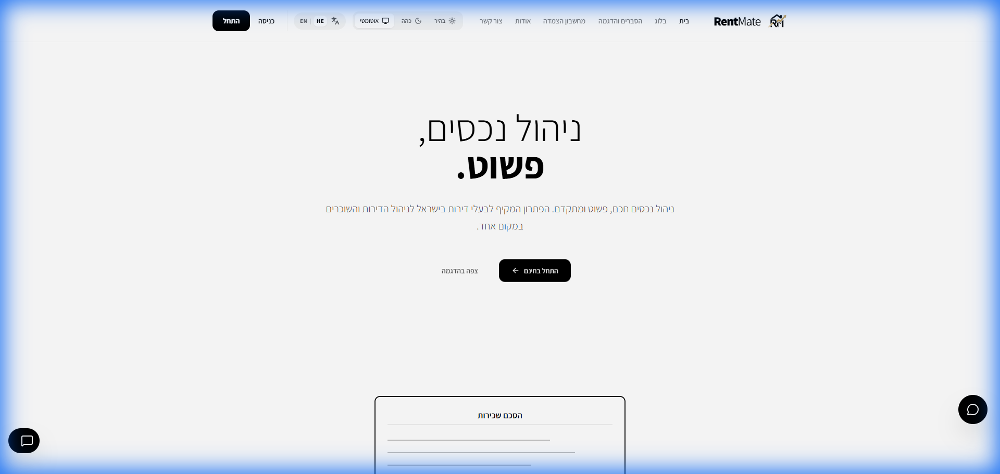
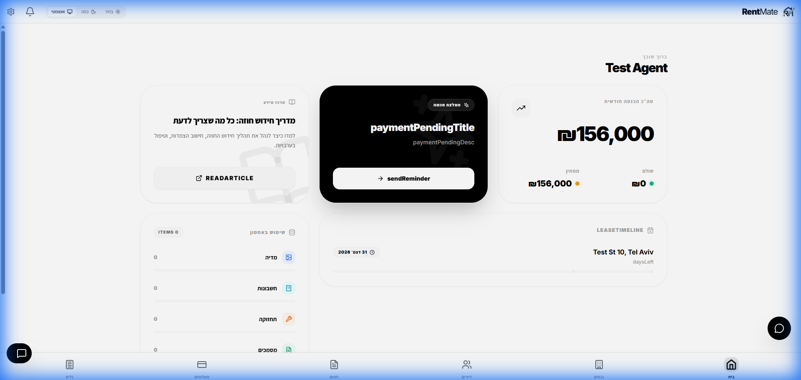
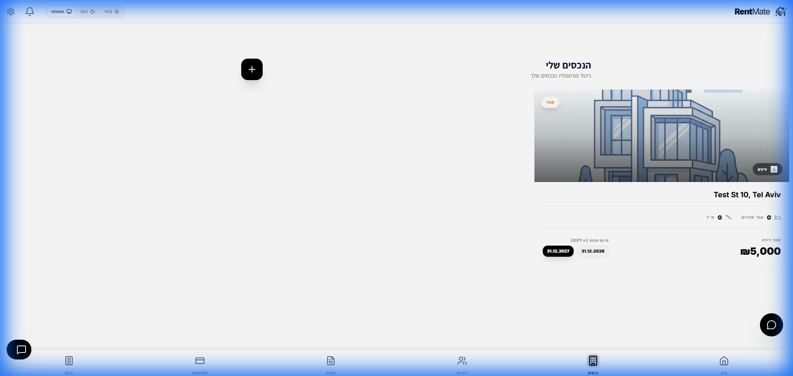

# RentMate: App Features & Navigation

RentMate is designed to be the central hub for property landlords in Israel. The app provides a high-end, minimal clean (Black & White) user interface with a glassmorphism (Glass Bionic) aesthetic.

## 1. Dashboard
The Dashboard is the first page users see upon logging in.

It features:
- **Financial Overview**: Total monthly rent collection, outstanding debts, and upcoming payments.
- **Visual Analytics**: Charts showing rent occupancy and storage usage.
- **Activity Feed**: Real-time notifications about contract expirations, utility bill payments, and maintenance requests.
- **Skeleton Loaders**: Premium loading states that mimic the widget layout during data fetching.

## 2. Properties (Assets)
- **Grid/List View**: Users can view all their assets at a glance.
- **Storage Management**: Each property has a local storage quota (monitored in the Storage Management section).
- **Property Details**: Includes address, property type, and associated tenants.

## 3. Tenants
- **Profile Management**: Tracks tenant contact details, payment history, and links to active contracts.
- **Communication**: Integrated tools to contact tenants via WhatsApp or Email.

## 4. Contracts
- **Wizard-based Creation**: A multi-step form to add new contracts, including extension options and linkage rules.
- **AI Analysis**: Contracts can be analyzed by AI to extract key dates, clauses, and financial obligations.
- **PDF Generation**: Standardized rental contracts can be generated as PDF documents.

## 5. Navigation & UI
- **Responsive TopBar**: Quick access to notifications, language switching (Hebrew/English), and admin panel (for admins).
- **Glass Shell**: A persistent sidebar/bottom-nav for mobile that allows for instant tab switching with prefetching technology.
- **Dark Mode**: Fully supports a sleek dark mode with high-contrast text.
