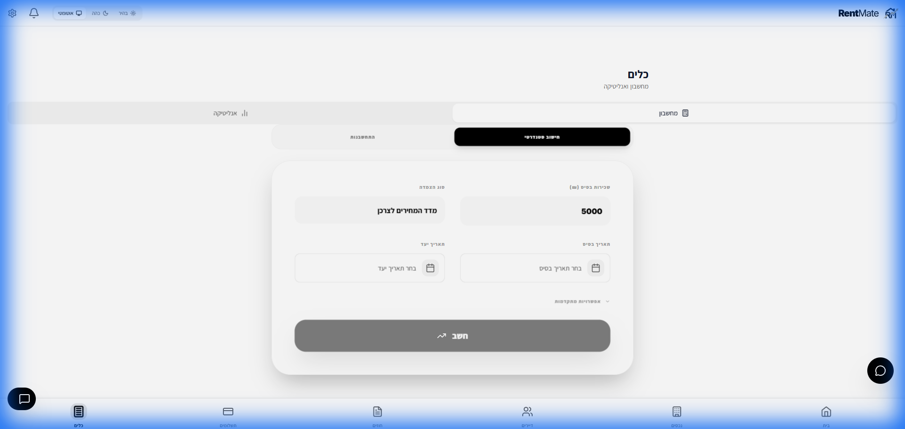

# RentMate: Advanced Calculator & Ledger Logic

The RentMate Advanced Calculator is a professional-grade tool designed for the Israeli rental market, handling complex index linkages and debt accumulation.

## 1. Calculation Methods & Logic
- **Fixed Rent**: Simple monthly rent without linkage.
- **CPI Linkage (מדד המחירים לצרכן)**: Unlike simple agreements, RentMate automates adjustments based on the Israeli Consumer Price Index. It involves complex math comparing a base-index against a new-index to determine the "Linked Rent" (שכירות צמודה).
- **Manual Index Overrides**: A critical capability for unique legal contracts. The system allows users to manually override index values within the Monthly Detail (פירוט התחשבנות) to ensure the math reflects their specific agreement.
- **Running Ledger (תזרים מזומנים/כרטסת)**: A complex accounting method that tracks payments vs. obligations over time. It identifies if a tenant has paid "too much" or "too little" at any given point.

## 2. Key Terms
- **Base Rent (שכירות בסיס)**: The amount agreed upon in the contract before linkage.
- **Linked Rent (שכירות צמודה)**: The final amount after calculating CPI or other variations.
- **Balance (יתרה)**: The difference between expected payments and actual received payments.
- **Debt (חוב)**: Accumulated negative balance over time. It manages fluctuating balances and identifies "paid too much/little" scenarios.

## 3. Sharing Calculations
- **Shared Links**: Calculations can be shared with tenants or partners via a secure, shortened link (`/s/:slug`).
- **PDF Export**: Full ledger reports can be downloaded as PDFs with professional headers and tables.

## 4. UI Precision
- **Monthly Detail (פירוט התחשבנות)**: Formerly known as "Monthly Breakdown", this table shows the exact math for every month of the contract.
- **Advanced Controls**: Users can manually override index values if they have specific agreements.
